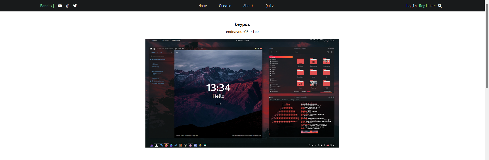

# Pandex

*This was created for 10ist web design project*  
### About the website
Pandex is a place to share screenshots and configurations of all your *nix desktops, themes or any other customisations  
Currently [live on heroku](https://thepandex.herokuapp.com/)
### Technologies used
**Frontend**  
* [React](https://reactjs.org) **:** Chosen javascript libary to create responsive and reactive websites  

**Backend**
* [Node.js](https://nodejs.org/en/) **:** A Runtime environment that allows JS to run server side
* [Express](https://expressjs.com/) **:** Back end web application framework for Node.js  
**Other dependancies include:**
* [Bcrypt](https://www.npmjs.com/package/bcrypt) **:** Library to help hash passwords
* [Multer](https://www.npmjs.com/package/multer) **:** Handles file uploads, specificly images in my case
* [Mongoose](https://mongoosejs.com/) **:** A MongoDB object modeling tool  

**Database**
* [MongoDB](https://www.mongodb.com/) **:** A document oriented NoSQL database
